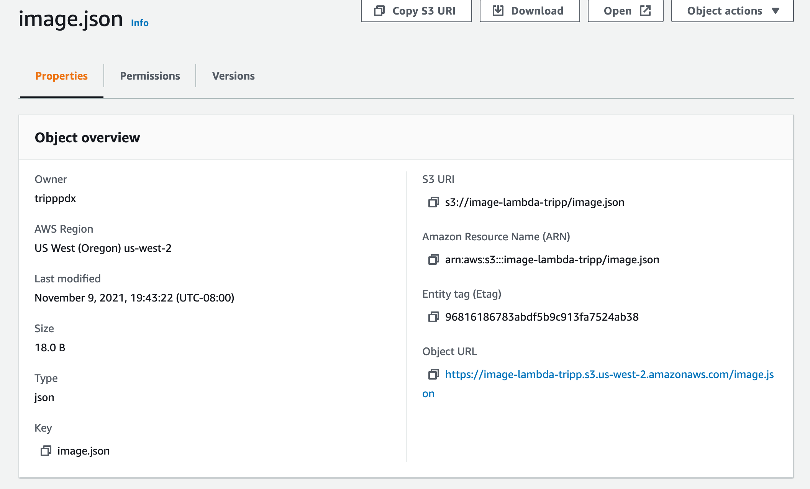

# image-lambda

Created by Harvey Lucas

## images.json

https://image-lambda-tripp.s3.us-west-2.amazonaws.com/images.json

## Usage

- Upload file to S3 URI: s3://image-lambda-tripp/images/
- This will trigger lambda to update image.json at https://image-lambda-tripp.s3.us-west-2.amazonaws.com/image.json with image metadata.

## Issues

- Issues were related to permissions. It was necessary to edit the JSON of the AWSLambdaBasicExecutionRole policy to allow s3:GetObject and s3:PutObject actions.

## Summary of Problem Domain

### Lab: Class 17

AWS: S3 and Lambda

- Create an S3 Bucket with “open” read permissions, so that anyone can see the images/files in their browser
- A user should be able to upload an image at any size, and update a dictionary of all images that have been uploaded so far
- When an image is uploaded to your S3 bucket, it should trigger a Lambda function which must

1. Download a file called “images.json” from the S3 Bucket if it exists. The images.json should be an array of objects, each representing an image. Create an empty array if this file is not present
2. Create a metadata object describing the image Name, Size, Type, etc.
3. Append the data for this image to the array. Note: If the image is a duplicate name, update the object in the array, don’t just add it
4. Upload the images.json file back to the S3 bucket

## Visual

